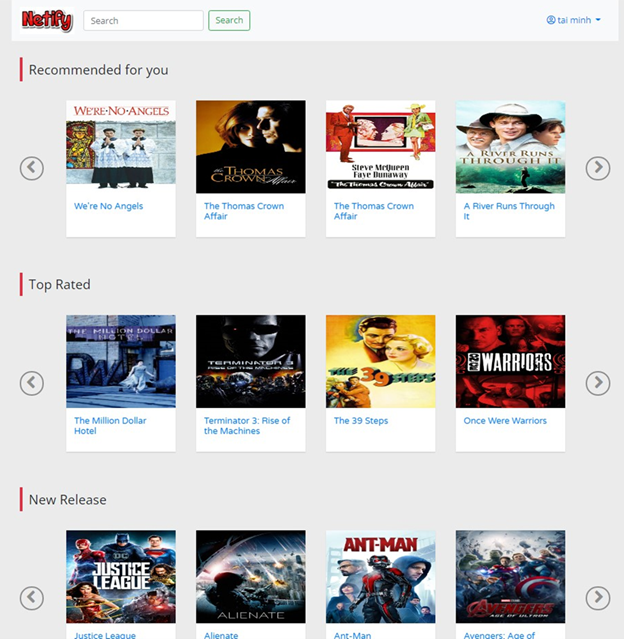
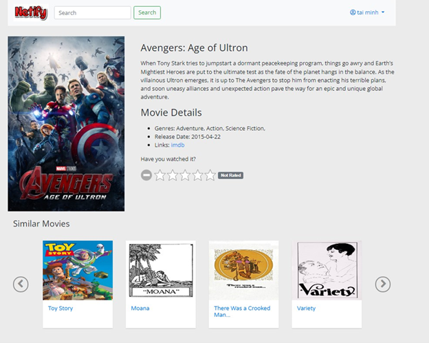
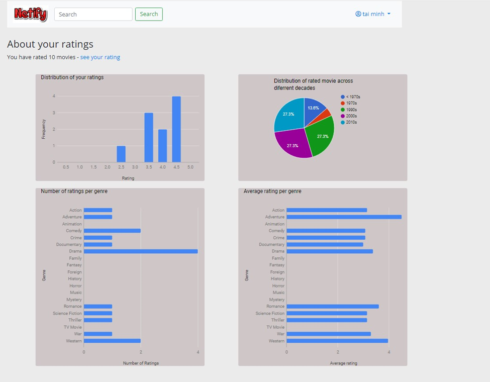
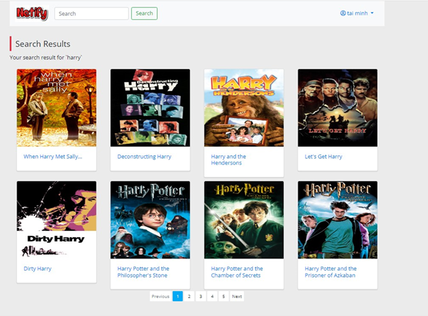

# Movie Recommendation System Project

A simple web application with Flask that using machine learning provides movie recommendations to users

## Features

-   Basic Authentication
-   Personalized Recommendation with Kernal Matrix Factorization method
-   Recommend movies with a similar plot by using the TF-IDF method
-   Visualization for the user to have a better insight about his/her rating
-   Simple searching function allows users to search movies

## Screenshots

   
  
  
  

## Further improvement

My future goal is to research more into recommender system design and experiment with SOTA recommendation methods

### References

-   Data source: https://www.kaggle.com/rounakbanik/the-movies-dataset
-   TMDB API for the image assets
-   The matrix factorization is not implemented from scratch, the implementation of the algorithm is from: https://github.com/Quang-Vinh/matrix-factorization
-   Google Chart: https://developers.google.com/chart
